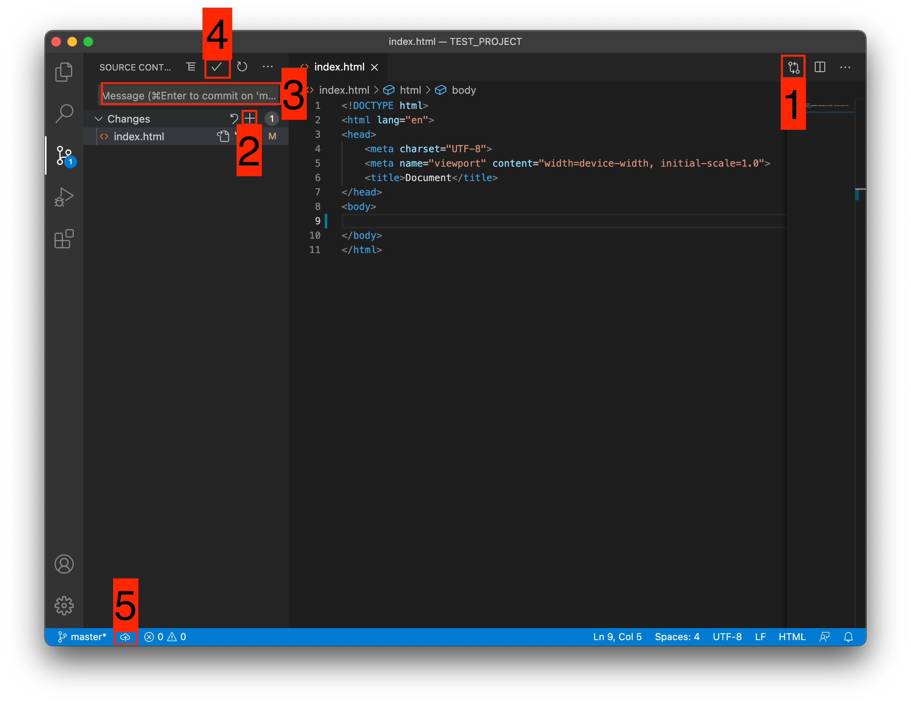

[< к содержанию](./readme.md)

## Cоздание проекта на Github

---

Для создания проекта перейдем во вкладу для работы с Git-ом.

Откроется вот такое окно:

  1. Кнопка для публикации нашего проекта на GitHub

  2. После нажатия на кнопку 1 , появится всплывающее окно. Нужно выбрать второй вариант или там где присутствует фраза ...public repository

    Если вы хотите создать локальный репозиторий и опубликовать код в другой сервис, то необходимо нажать на кнопку Initialize Repository . После этого, вручную выбрать сервис куда публиковать.

После того, как выбрали "Опубликовать на GitHub публичный репозиторий" (пункт 2), программа предложит вам выбрать файлы, которые будут входить в первый commit. 

Проставляем галочки у всех файлов, если не проставлены и жмем ОК . Вас перекинет на сайт GitHub, где нужно будет подтвердить вход в аккаунт.

Вы создали и опубликовали репозиторий на GitHub.

Теперь сделаем изменения в коде и попробуем их снова опубликовать. 

Перейдите во вкладку с файлами, отредактируйте какой-нибудь файл, не забудьте нажать crtl+s (Windows) или cmd+s (MacOS), чтобы сохранить файл. Вернитесь обратно во вкладу управления Git.

Если посмотреть на значок вкладки Git, то можно увидеть цифру 1 в синем кружке. 

Она означает, сколько файлов у нас изменено и незакоммичено. Давайте его закоммитим и опубликуем:

  1. Кнопка для просмотра изменений в файле. Необязательно нажимать, указал для справки

  2. Добавляем наш файл для будущего commit

  3. Пишем комментарий

  4. Создаем commit
  
  5. Отправляем наш commit в GitHub

  Поздравляю, вы научились создавать commit и отправлять его в GitHub!

  ---

[< Назад](./project.md)