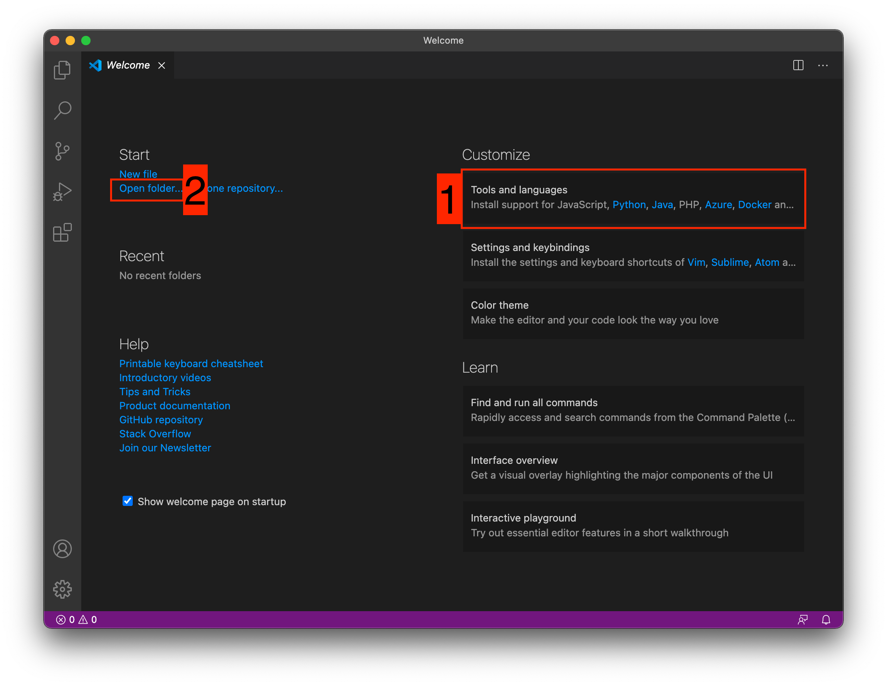

[< к содержанию](./readme.md)

## Создаем свой первый проект и выкладываем на GitHub

---

Давайте разберемся как это сделать, с помощью среды разработки Visual Studio Code (VS Code).

Перед началом предлагаю зарегистрироваться на [GitHub](https://github.com/).

Создайте папку, где будет храниться ваш проект. Если такая папка уже есть, то создавать новую не надо.

После открываем VS Code.

1. Установите себе дополнительно анализаторы кода для JavaScript и PHP

2. Откройте вашу папку, которую создали ранее

После этого у вас появится вот такой интерфейс

---

[< Назад](./discriptgithub.md)